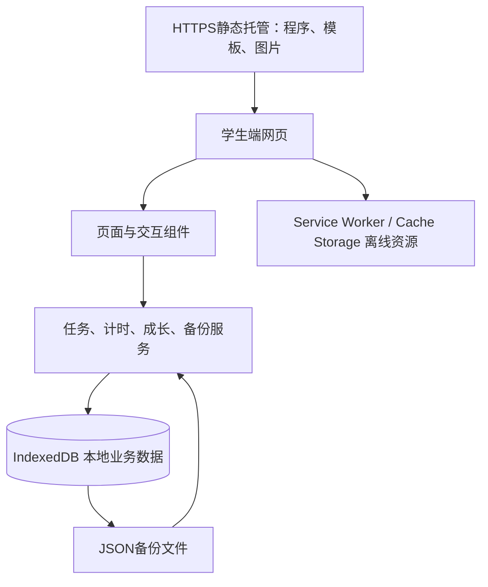

# 成长森林轻量技术实现方案

版本：V1.0 · 2026年9月11日  
依据：《成长森林学生端产品初步方案-V2.0》及《低年级视觉设计说明》  
定位：面向小学一至三年级的学生端网页应用；本文件为实施设计，尚未开始开发。

修订说明：导航与页面分工以《成长森林系统详细设计》三入口为准；奖励采用“我的成长—我的奖励”的现实礼品兑换，取消装饰兑换。

## 1. 推荐路径

采用 **Vue 3 + TypeScript + Vite + IndexedDB（Dexie）+ PWA**，构建一个纯前端应用，发布到稳定的HTTPS静态地址。

孩子打开链接，填写资料，在浏览器中保存任务和成长记录。静态托管只分发程序、模板与图片；学生业务数据不经过业务服务器。安装到桌面是可选体验，不影响链接直接使用。

轻量化主要来自：一个代码工程、一套响应式页面、一个本地数据库、一份静态资源目录。完整保留任务奖励可配置、专注统计、六位伙伴及本地备份。复杂动画和换装可以分批完善，数据正确性必须从第一版建立。

当前工作区只有产品与视觉资产，没有既有应用代码，适合从小型单工程开始。

## 2. 总体结构



页面只负责展示和收集操作；业务服务负责奖励、日期、计时等规则；数据库负责可靠保存。没有网络时，后两层仍能运行。Service Worker负责资源缓存，不承担后台计时或午夜日结。

## 3. 技术选型与依赖控制

| 位置 | 推荐实现 | 使用理由 |
| --- | --- | --- |
| 页面 | Vue 3 单文件组件、TypeScript | 表单、任务状态和组件复用清晰 |
| 构建 | Vite，npm及锁文件 | 构建为静态文件；依赖版本在开工时锁定 |
| 导航 | Vue Router，Hash模式 | 简化静态托管，刷新子页面无需重写路由 |
| 样式 | 原生CSS、CSS变量、Grid/Flex | 直接承接绘本风格，避免引入整套后台UI库 |
| 持久化 | Dexie封装IndexedDB | 支持索引、事务和版本迁移 |
| 页面数据 | Dexie liveQuery + Vue组合函数 | 数据库是业务事实来源；不再维护一套持久化全局状态 |
| 临时状态 | Vue ref/reactive、provide/inject | 保存弹窗、筛选、未提交表单；首版无需额外状态库 |
| 离线 | vite-plugin-pwa，generateSW，提示更新 | 减少手写缓存逻辑，更新由应用协调 |
| 数据校验 | Zod，用于导入与关键命令 | TypeScript不能验证用户导入文件的运行时内容 |
| 图表 | 小型SVG柱图、折线图＋文字数据 | 首版统计简单，无需完整图表框架 |
| 日期 | 集中日期模块，固定首版时区；扩展时引入成熟时区库 | 防止各页面独立计算日期 |
| 测试 | Vitest、fake-indexeddb；Playwright关键流程 | 重点覆盖奖励、恢复和计时异常 |

建议首版界面暂不开放时区编辑，按Asia/Shanghai运行，数据库仍记录日期归属和时区。此项是缩减实现复杂度的建议；若要求首版保留时区修改，需要同时实现次日生效与跨日拆分测试，不能只增加一个下拉框。

Vue官方推荐新工程使用Vite。[Vue工具链说明](https://vuejs.org/guide/scaling-up/tooling.html)  
Dexie提供事务和响应式查询能力。[事务文档](https://dexie.org/docs/Dexie/Dexie.transaction%28%29)、[liveQuery文档](https://dexie.org/docs/liveQuery%28%29)

## 4. 页面落地与组件复用

建议以首页方案2「今日清单」作为实现基底，吸收方案3「一次一件事」的突出主任务方式；方案1的森林场景用于成长乐园。这是技术与交互建议，尚不视为用户已经选定视觉方案。

| 页面 | 首版呈现 | 主要复用组件 |
| --- | --- | --- |
| 欢迎与建档 | 称呼、年级、伙伴，一页完成 | 输入框、伙伴选择卡 |
| 今日行动 | 当前伙伴、首项任务、其余任务、今日时长 | 任务卡、星星数字、空状态 |
| 探索发现 | 四类模板、目标与计划列表，编辑独立子页 | 分类标签、模板卡、计划表单 |
| 专注 | 大号时间、暂停与结束、简短任务标准 | 全局计时控制器、恢复提示 |
| 我的奖励（我的成长二级页） | 奖品设置、兑换、领取、取消与流水 | 奖品卡、确认框、兑换记录 |
| 我的成长 | 日周月切换、时间轴、简单统计 | 日期切换、趋势图、记录列表 |
| 设置 | 资料、声音、动效、备份、恢复、已删除项 | 设置行、文件选择、确认对话框 |

基础组件控制在约12—15种。主要按钮高度60px，正文20px，辅助文字至少16px；提供可见键盘焦点。手机单列，平板增加留白与适度双列，桌面限制内容最大宽度。按内容空间调整布局，不制作三套页面。

计时器放在应用级服务中，离开计时详情页仍能通过固定入口返回；浏览器页面隐藏才触发自动暂停。导航不能销毁计时状态。若业务希望离开计时页也暂停，应另作为明确规则处理。

## 5. 现有视觉素材如何进入程序

现有57张PNG包含6位伙伴、40张图标、8件装饰与背景、3张页面设计稿。页面设计稿仅作为布局参考，不作为整屏背景图片使用。文字、按钮、进度与导航必须是真实网页元素。

### 5.1 上线资源

保留原图作为设计源文件，通过构建前脚本生成运行尺寸的WebP，并保留必要PNG回退。透明资产保留Alpha通道。

| 素材 | 建议运行尺寸 | 目标体积，须实测 |
| --- | --- | --- |
| 伙伴主图 | 512／768px | 每张约100—250KB |
| 成就、勋章 | 128／256px | 每张约10—30KB |
| 配饰、摆件 | 256／512px | 每张约30—100KB |
| 场景背景 | 最长边约1280px | 每张约150—350KB |

以上是优化预算，不是现有文件已达到的结果。现有约77MB素材包不能原样作为首次下载内容。

建议首屏压缩后总传输量控制在1.5MB左右，首屏JS+CSS控制在250KB左右；完整运行资源争取控制在8MB内。用实际构建和目标设备验证后再调整预算。系统字体本地调用，不下载大型中文字体。

资产清单使用固定ID，例如A01、M01、D01和tuantuan。数据库仅保存ID及获得记录，不保存图片Base64。普通UI图标单独采用简单线性图形；已有复杂徽记优先在较大的收藏卡中展示，缩小到48px前需检查辨识度。

### 5.2 成长与装饰的边界

六位伙伴现有资源仅为基础形态。内部试用可以先用基础图配阶段名称、进度条，完整交付三阶段形象仍需补齐剩余12幅图，不能把名称变化视作全部形态设计已完成。

先接入背景、摆件、相册框。帽子、围巾、书包采用固定位置叠加，每位伙伴配置坐标比例、缩放和前后层级，无需自由拖拽或游戏引擎。现有角色自带配饰，叠加可能冲突：正式穿戴前须制作可替换的底图或限定已适配组合。这些配饰作为视觉源素材保留，本次不实现装饰兑换或装备。

页面动画只采用短暂CSS位移、缩放与淡入；专注期间关闭循环动效，并尊重减少动效设置。

## 6. 本地数据设计

一个IndexedDB数据库保存业务；静态模板作为随版本发布的JSON；localStorage不保存任务、星星或计时事实。

| 表 | 内容与关键约束 |
| --- | --- |
| profile/settings | 单学生档案、时区、声音、动效、版本 |
| goals/plans | 目标、计划规则、模板快照、默认星星、配置版本 |
| tasks | 安排日期、原发生日期、状态、星星覆盖值、锁定值、来源快照 |
| focusSessions | 模式、目标秒数、会话状态、有效时长、结束原因 |
| focusSegments | 连续片段、日期拆分、检查点；不为每次心跳新建一条记录 |
| growthEvents | 完成、自查、心情、成就和勋章等事实 |
| journeys/dailySettlements | 每段伙伴旅程、每日归属、唯一日结 |
| starLedger | 获得与消费流水，幂等业务键 |
| prizes / redemptions / rewardImages | 礼品配置、不可变订单快照、领取取消状态、本地图片 |
| runtimeControl | 单计时会话所有者、写入代次、维护模式 |

所有业务记录带学生ID、创建时间、更新时间；可删除对象保留deletedAt。时间点保存UTC时间戳，发生日保存档案时区日期。星星使用整数；建议首版输入范围0—99，作为待纳入详细规格的默认值。

常用索引：任务安排日、任务完成日、计划ID、会话结束时间、片段日期、事件日期。计划实例唯一键采用「计划ID＋原始发生日期」，改期不修改原始发生日期，不以新安排日重新生成同一实例。

统计先按日期索引查询后即时计算，不维护多套易失真的汇总表。日结属于业务事实，必须保存。后续数据量增加再引入可重建的汇总缓存。

## 7. 三类必须可靠的事务

### 7.1 任务完成和星星

同一事务内：读取任务状态 → 锁定奖励值 → 写入完成结果与实际完成日 → 写入唯一完成事件 → 写入星星流水 → 首次完成时锁定当日旅程归属。

奖励键使用task-complete:任务ID。重复提交直接返回已有结果，0星任务也保存完成事实。事务成功后才展示获得星星；失败时保留输入并显示尚未保存。

首次开始或启动计时即锁定奖励；未开始任务单独覆盖优先；已开始后改期、暂停不解除锁定。计划更新只能修改符合生效条件且无单独覆盖的未来任务。

### 7.2 礼品兑换、领取与退款

兑换确认以requestId去重，事务内检查奖品启用状态、版本和流水余额，保存名称、说明、价格及不可变图片引用快照，创建待领取订单并写入redeem:订单ID扣星流水。价格变化必须重新确认。同一礼品可再次主动兑换，但每次确认只生成一单。

领取仅允许待领取转已领取，不再扣星。取消仅允许待领取转已取消，事务内按订单价格快照写入唯一refund:订单ID退款流水并更新状态。领取和取消并发只允许一个成功，重复取消不能再次退款。退款单列，不作为任务获得星星。

### 7.3 日结

启动、回到可见状态和跨日检查时，处理已经结束且有相关记录的日期，按日期顺序结算；按学生＋日期唯一保存。完成数达到4才增加1点开心值，和获得几颗星星无关。

一个日期归属一段旅程。10／20／30点阶段推进与日结在同一事务完成，重试不重复升级。批量补算按日推进，阶段变化及60日旅程结束不能被一次累加跳过。长时间未使用时无需逐日生成空记录。

## 8. 专注计时实现

采用小型状态机：未开始 → 运行 → 暂停 → 运行／结束；中断恢复到暂停；作废仅作用于已结束记录。

显示每秒刷新，累计值以单调时间差计算，不能使用“回调触发一次就加一秒”。每5秒更新当前片段检查点，暂停、结束和隐藏时尽力立即提交。记录内部可使用毫秒整数避免逐次取整损失，对外统计按秒汇总。

通过visibilitychange在页面隐藏时自动暂停，返回后手动继续。[Page Visibility API](https://developer.mozilla.org/en-US/docs/Web/API/Page_Visibility_API)

系统终止页面时无法保证最后一次异步写入完成，所以恢复只认最后成功检查点；5秒是正常运行目标，不承诺所有设备异常下最多丢5秒。保存失败时暂停计时并保留内存数据，提示重试或导出。

同时比较单调时间和墙上时间：出现显著跳变或长回调空档，关闭当前连续片段，自动暂停，不计异常空档。初始空档阈值可设为5秒，经低端设备测试后调整。倒计时只累计到目标；正计时连续60分钟暂停。

### 多标签页

优先使用Web Locks约束同源计时控制，再由IndexedDB事务中的ownerId和generation代次校验每次写入。消息通知用于刷新界面，不能替代互斥。[Web Locks API](https://developer.mozilla.org/en-US/docs/Web/API/Web_Locks_API)

接管先请求旧页保存暂停，再交接所有权。旧页失联时只沿用已保存检查点，并在事务中更换代次；旧页恢复后的过期写入必须被拒绝。旧页未保存的尾段不补计。浏览器缺少Web Locks时使用同一数据库控制记录进行事务仲裁，仍校验代次；不能通过localStorage布尔值冒充可靠锁。

### 统计

有效片段按实际日期拆分；会话次数归结束日；平均时长使用该区间结束会话的完整时长。暂停分主动与自动，异常不标记为分心。聚合函数独立于界面，同一口径用于报表和CSV。

## 9. 离线、更新和备份

### 离线资源

应用壳、四个入口的代码、模板和运行尺寸图片纳入明确版本的缓存清单。首次可先显示首页，但只有完整必需资源缓存成功才提示可离线使用。无网且某个可选素材未缓存时显示占位，不阻断保存业务。

Service Worker与Cache Storage保存资源；IndexedDB保存学生数据。清理旧资源缓存不能清理数据库。vite-plugin-pwa可生成Service Worker并提供更新提示。[PWA策略](https://vite-pwa-org.netlify.app/guide/service-worker-strategies-and-behaviors)、[提示更新](https://vite-pwa-org.netlify.app/guide/prompt-for-update.html)

### 更新

使用提示更新模式，默认不强制刷新。所有标签页无运行计时、写入完成后进入维护状态再激活更新。旧标签页关闭数据库连接；新版本执行事务迁移，失败回滚。旧代码发现不支持的数据版本时停止写入。

首版尽量采用新增字段和表的兼容迁移。大规模格式变化单独设计暂存与切换方案；静态文件回滚不代表数据库可以随意降级。

### 备份和导入

JSON包含schemaVersion、appVersion、exportedAt和全部业务表，含礼品、订单及用户图片的Base64与MIME；内置静态图片只存ID。导入验证图片格式、大小及引用。不可变用户图片保存在IndexedDB，换图不覆盖历史订单引用。备份前暂停计时，使用一致的读取事务获取快照。导出按钮生成下载，不声称已经验证磁盘落盘。

导入按以下顺序执行：

1. 在内存验证文件大小、JSON结构、支持版本、ID唯一性、关联完整性及数值范围。
2. 展示称呼、时间、记录数，先导出当前备份，确认整体替换。
3. 进入跨标签页维护模式，暂停计时并阻止其他写入。
4. 在覆盖全部业务表的单次事务内替换，运行会话转为暂停；失败则原数据保持不变。
5. 成功后通知其他标签页重新读取，再解除维护状态。

浏览器持久存储请求只能作为辅助，不能替代文件备份，也不能防止用户主动清除。[StorageManager.persist](https://developer.mozilla.org/en-US/docs/Web/API/StorageManager/persist)

CSV仅作报告，正确处理引号、换行及以等号等字符开头的用户文本，避免被表格软件当作公式。错误导入内容只作为数据解析，不执行脚本或渲染HTML。

## 10. 工程组织

```text
src/
  app/                 路由、启动、离线与更新协调
  pages/               四个主页面、欢迎、专注、设置
  components/          按钮、任务卡、伙伴舞台、收藏卡
  domain/              任务、奖励、计划、成长、统计纯规则
  services/            完成任务、兑换、计时、备份等命令
  db/                  表结构、事务、迁移
  composables/         本地查询与页面状态
  content/             六位伙伴、模板、40种徽记、装饰配置
  styles/              颜色、字号、间距、响应式
public/assets/         优化后的运行图片
tests/                 规则测试与关键浏览器流程
```

业务服务直接调用本地数据库，不额外模拟HTTP接口。纯规则与浏览器API分开，便于测试。模板修改通过发布静态版本完成，不做配置后台。

## 11. 分阶段落地

以下为1名熟悉Vue的前端开发者、配合设计验收的粗估；不含新增插画制作和发布外部流程，实际以任务拆分后估算为准。

| 阶段 | 交付 | 估计工作量 | 完成条件 |
| --- | --- | --- | --- |
| A 可用闭环 | 建档、今日任务、星星设置、计时、基础统计、本地保存、JSON备份恢复 | 7—10人日 | 刷新恢复正确；无重复奖励；备份可还原 |
| B 完整成长 | 目标计划、任务生成、六伙伴旅程、成就勋章、日结、礼品兑换领取退款、时间轴、CSV | 8—12人日 | 覆盖产品业务闭环及历史口径 |
| C 发布质量 | 素材优化、离线更新、迁移、多设备验证、交互完善 | 5—8人日 | 断网、锁屏、双标签和错误恢复通过 |

总计约20—30人日，可按4—6周安排完整首版。数据库事务、计时恢复与多标签控制从A阶段实现，C阶段做真实设备回归。A阶段是内部试用版本，不将缺失的成长功能算作完整产品交付。

首版可延后自由换装、复杂语音、丰富动画、复杂计划周期和XLSX。20类成就与20枚勋章按配置接入同一收藏组件，不需要制作40套业务页面。

## 12. 发布与验收

部署产物只有dist静态文件。选择可稳定访问、支持HTTPS和缓存头的静态托管；保持正式域名长期不变，同一站点升级。开发与预览使用独立地址，测试档案不混入正式站点。正式应用不能依赖file://打开方式提供PWA能力。

HTML与Service Worker采用可及时检查更新的缓存设置；带内容哈希的资源长缓存。构建资源随包交付，页面不从外部CDN实时加载字体或运行库。静态托管可能仍记录访问日志，因此“业务数据不上云”不等于“没有任何网络访问记录”。

优先验证Android Chrome、iPhone/iPad Safari和Windows Edge的当前稳定版本；浏览器安装模式也单独测试。内嵌浏览器作为补充验证范围，能力不足时提示使用系统浏览器；无痕环境提示临时保存风险，不声称能可靠识别所有无痕模式。

重点验收：

- 计划默认3星、单任务5星、0星及奖励锁定均正确。
- 重复完成、并发兑换、删除恢复不会重复结算。
- 6分钟＋暂停2分钟＋9分钟得到15分钟，连续最长9分钟。
- 隐藏、锁屏、刷新、系统休眠、保存失败、双标签接管结果一致。
- 跨日、跨周、跨月及无数据统计正确；日结补算仅发生一次。
- 10／20／30阶段规则和旅程重开保留历史。
- 整包离线进入四个主入口，所有核心操作与备份可用。
- 错误或中断导入、迁移失败、旧页仍开启时不破坏数据。
- 360px手机及平板无横向溢出，大字和按钮可用；收藏缩略图可辨识。

自动测试优先覆盖日期、奖励、计时状态机、事务与恢复；锁屏、存储压力和实际触摸体验必须真实设备验证。

## 13. 开发前收敛的默认项

本路径建议采用首页方案2为基底、奖励输入0—99、首版固定上海时区、装饰作为视觉资源、礼品兑换作为奖励功能上线。它们均为明确的实施建议，尚未修改原产品稿。

首先完成数据结构、事务命令和一个“建档—创建阅读任务—计时—发星—备份恢复”的可运行闭环，然后扩展四个空间与成长内容。这样每个阶段都有可验证的产品，同时将后续修改控制在单个模块内。

